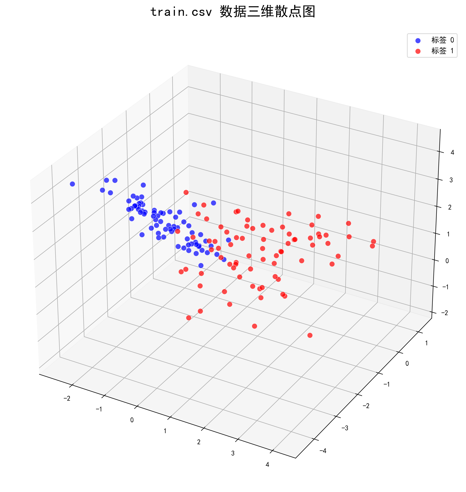
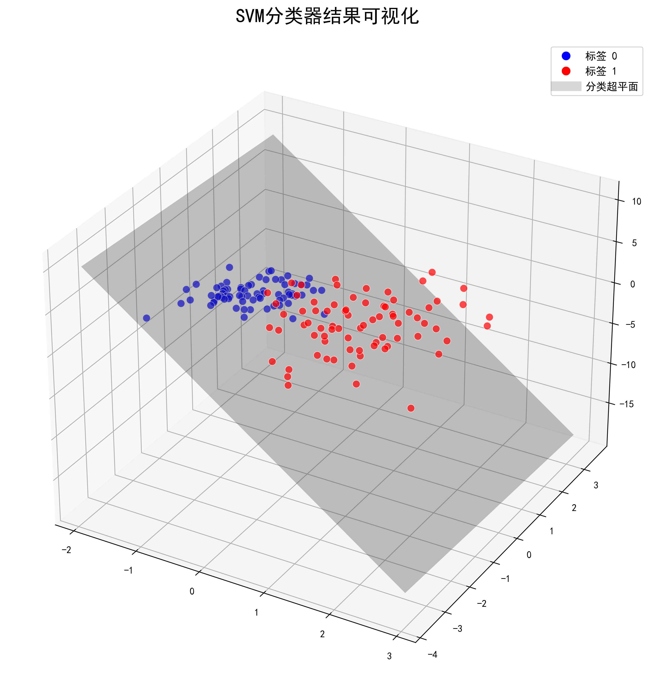

# 小A创新创业团队AI组考核一
> 本次考核主要内容为机器学习基础、数据可视化、pytorch基本用法（选择性学习）
## 1. 时间安排
一轮考核：
学习会的事情（问老万）
## 2. 基础任务 ==(必做)==
####  2.1 任务描述

在压缩文件中的data文件夹中包含了“一刀切”散点的训练集train.csv和测试集test.csv文件。其中
train.csv的可视化图像如下图所示：

> 在两个csv文件中前一二三列是特征(也就是上面二维坐标轴的点)，第四列是标签(二分类0和1)

#### 2.2 任务要求

1. 请你使用train.csv文件画出上述任务描述中的“一刀切散点图”
2. 请你使用经典的机器学习分类算法运用训练集(train.csv)的数据训练出一个分类器。
3. 将测试集(test.csv)的数据代入训练好的SVM分类器，==要求准确率达到90%==

下图是使用支持向量机找到的超平面训练出来的分类器

## 3. 进阶任务 ==(必做)==
数据存放在data文件夹中的“gandou.csv”文件中，包含了16个特征信息和1个标签信息，同时是一个4
分类问题

#### 3.1 任务要求
1. 数据集的划分，你需要将数据划分为训练集和测试集
2. ==数据清洗==
3. 你需要使用pytorch训练出一个分类器,要求测试集的准确率达到80%以上
4. ==你必须使用pytorch或者其他的深度学习框架！！！==

- <u>关于这个任务，我们将会提供以下两种方案，请你==选其一==来完成我们的进阶任务：</u>

>方案一：
纯 AI 生成编程。“请你使用任意大模型工具，设计最多两套提示词/输入两次提示，完成①数据预处理②整个模型的设计③结果分析”，不允许手写任何代码，你能改动的，只有注释。
如果你使用的是AI Vibe Coding IDE编程工具，那么你==最多只可以输入一次提示==。提交你的==使用心得报告与你的代码和提示词==。”

> 方案二：
AI辅助下的手写代码。在自己写代码的基础上，允许向大模型询问架构，你可以无限次提问，但需要导出完整聊天记录附上。如果是AI生成的代码，请你在所有其生成的函数/类/代码行中注释 ==# AI生成==
最终提交你的==使用心得、代码与聊天记录==。如果是Vibe Coding的IDE工具，只需提交代码与使用心得。

#### 3.2 参考资料
##### 3.2.1 Pytorch
- Pytorch学习视频：[PyTorch深度学习快速入门教程（p20~p24线性层)](https://www.bilibili.com/video/BV1hE411t7RN/?p=20&vd_source=548b6a518766a20698f51072efce5936) 
 (如果有时间的话，把其他课程学完也是可以的~)
- [Pytorch官方英文文档](https://docs.pytorch.org/docs/main/torch.html)
- [Pytorch中文文档](https://pytorch-cn.readthedocs.io/zh/latest/)

##### 3.2.2 深度学习的理论基础
- [吴恩达深度学习：](https://www.bilibili.com/video/BV12urfB1E7s/?spm_id_from=333.337.search-card.all.click&vd_source=618c465654e4ecea643b52d402170cb1)

##### 3.2.3 神经网络的描述
- [神经网络的blog](https://blog.csdn.net/illikang/article/details/82019945)

> ==任务驱动==，上述所提供的资料皆为参考资料，并不是需要全部看完了才可以完成考核。

## 4. 提交要求
学院_专业_名字.zip
├── 代码.py （可提交多个,但是需要注意文件命名，最好可以容易看出是哪一个任务的代码文件）
├── 说明.md （如果会使⽤markdown的代码块，可以不提交“代码.py”）
└── （其他⽂件，按需要都可以放进来。比如说这次需要额外提交==准确率截屏==）
- 除了markdown文件之外，Latex编辑的pdf文档和jupyter notebook编辑的ipynb文档也可以
- 在文档中可以填写一些自己对于算法的感想以及遇到的代码bug(准确来说就是你是怎么完成上述的
考核)
- 保存的模型可以不用上传
- 如果遇到问题，⾸先尝试⾃⾏解决，⽆论是上⽹查资料（csdn等），还是询问AI（⾖
包，Qwen，gemini等都很好⽤），然后才是向他⼈寻求帮助（既可以向群里的小伙伴求助也可以找师兄师姐帮忙）。==反正无论如何，都要学会自己思考~==
完成请提交至邮箱：xiaowanting167@gmail.com